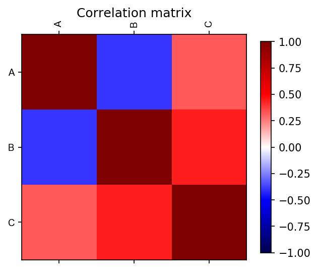

# Correlation Matrix Example App

This tool returns a correlation matrix and a correlation matrix plot. The correlation between the data can be calculated by Pearson, Spearman or Kendall's method.  The input type is a comma separated values file with columns with each numerical variable to correlate.


#### Example

**Input:**

```
A,B,C
15,20,25
10,38,70
15,35,20
70,21,55
17,18,16
```

Other parameters for the tool are the method to calculate the correlation: Pearson (default), Kendall or Spearman. And the color scale, seismic (default) and many others. 

**Output:**

```
          A         B         C
A  1.000000 -0.396880  0.322275
B -0.396880  1.000000  0.439338
C  0.322275  0.439338  1.000000
```
 

